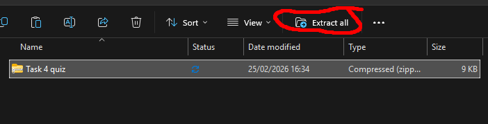
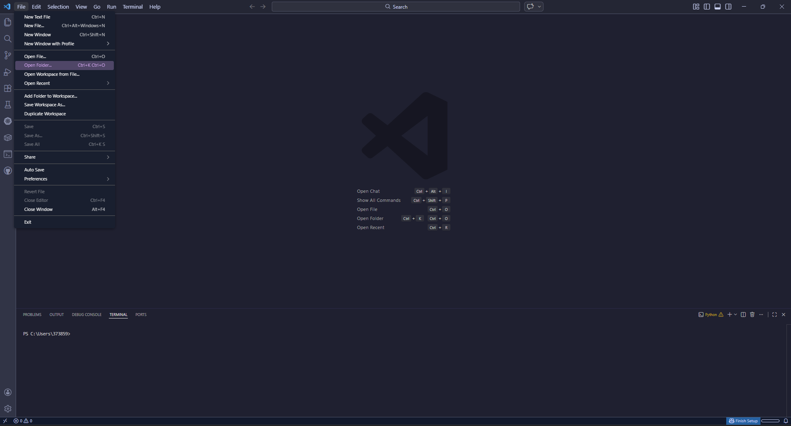
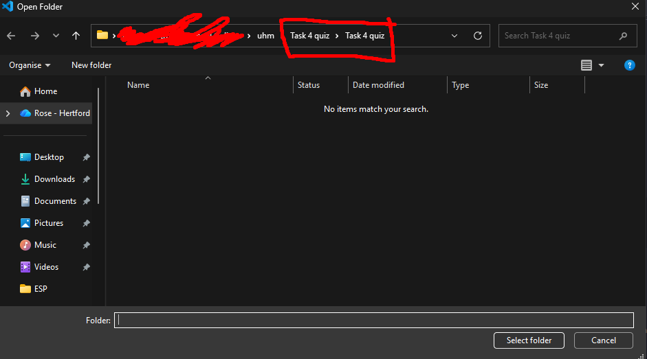
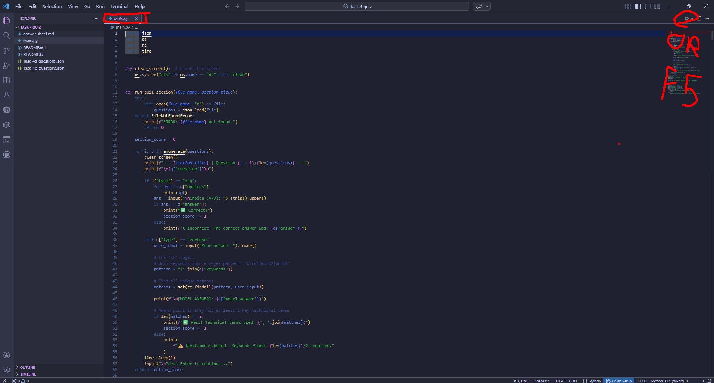
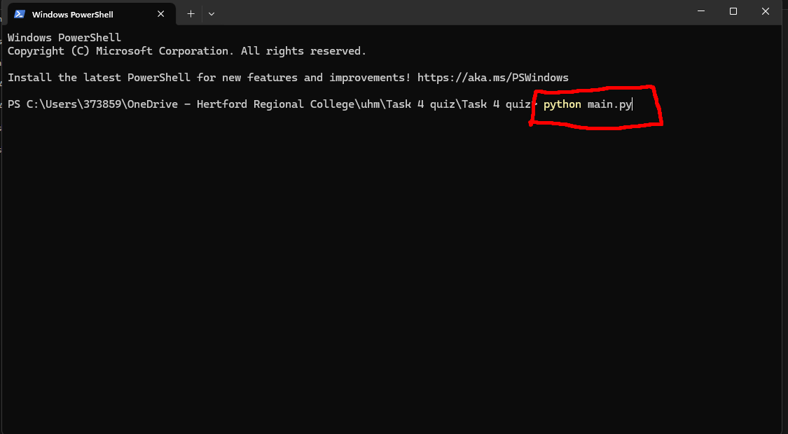

# Task 4 Quiz

### This is a quiz for Task 4a and 4b for the Software Development T-level course (Specifically the ESP)

---

# 🚀 How to run the quiz

### 0. Extract the files
Before running the quiz, you must extract the project from the compressed folder:
1. Right-click the `.zip` file.
2. Select **'Extract All...'** and choose a destination folder.
### OR
click the button to extract the file in explorer.


---

## Option 1: The Easy Way (VS Code)
1. **Open VS Code** and go to `File > Open Folder`.


2. **Locate the extracted folder** and select it to open the project workspace.


3. **Open `main.py`** and run it by clicking the 'Play' button or pressing `F5`.


---

## Option 2: The "scary" Way :3 (Terminal)
1. **Open in Terminal:** Navigate to your folder in File Explorer, right-click in the empty space, and select **'Open in Terminal'**.


2. **Type and Run:** Type the following command and press Enter to start the quiz:
```bash
python main.py
```


---

# Information about this quiz
- Marked out of **28 total** (6 MCQ × 1 mark + 4 Verbose × 3 marks, per section)
- MCQ questions are right or wrong (1 mark each)
- Verbose questions are marked proportionally based on technical keywords used (0–3 marks each)
- Grade thresholds: **Distinction ≥ 80%**, **Merit ≥ 60%**
- No time limit
- 10 questions on part 4a and 10 questions on part 4b

---

## Roadmap
- [x] Dynamic marking — proportional marks based on keyword depth
- [ ] Add a GUI?!
- [ ] Add a timer
- [ ] Add a leaderboard
- [ ] Add a feature to write the answers to a file for later review or teacher review
